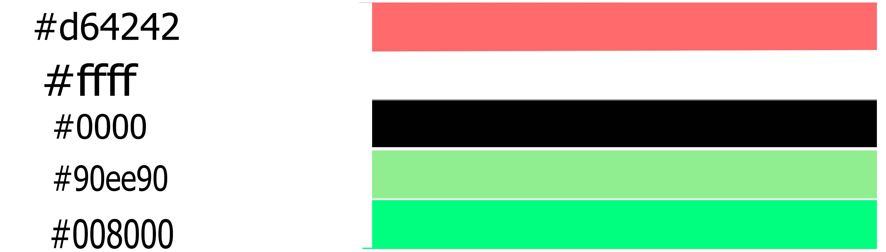

<h1>superman at war</h1> 

A game based on a game called flappy bird. in this game instead of bird there is a famouse cartoon character namely Superman is flying and avoiding the most dangrouse substance for him called Kryptonite. which makes superman a normal human being. So, in this game Superman have to avoid Kryptonite to stay alive.

<h2>Wireframes</h2>

There are frames for a full width display and a small mobile device. The final game varies slightly from the wireframes due to developments that occured during the creation process. 

<h1>Design Choices</h1>

<h2>Typography</h2>

only 1 font is chosen for different parts to keep game simple.
<ul>
<li>"Arial, Helvetica, sans-serif" is been used for game message and score</li>
</ul>

<h2>Color Scheme</h2>

Color scheme is very simple for player to avoid any problem.

<h1>Features</h1>

The game is set to be very easy to use. there are not too much control buttons but just one. only to get enter into game need to press Enter and then only Uparrow to play game.

<h2>Controls</h2>

on right top there is a play button by which user can control sound any time. this button works to play and pause the background sound.

<h2>character</h2>

Superman character is been used for this game

in background there is GIF file been used to look it more attractive.

<h2>Technologies Used</h2>
<ul>
<li>HTML5- provides the content and structure for the website.</li>
<li>CSS- provides the styling.</li>
<li>JavaScript- provides main key functions to game</li>
<li>PhotoShop- provides the styling.</li>
<li>Gitpod - used to deploy the website.</li>
<li>Github - used to host and edit the website.</li>
</ul>

<h1>Deployment</h1>

<h3>To deploy the project</h3>

The site was deployed to GitHub pages. The steps to deploy a site are as follows:

<ol>
<li>In the GitHub repository, navigate to the Settings tab.</li>
<li>Once in Settings, navigate to the Pages tab on the left hand side.</li>
<li>Under Source, select the branch to master, then click save.</li>
<li>Once the master branch has been selected, the page will be automatically refreshed with a detailed ribbon display to indicate the successful deployment.</li>
</ol>
